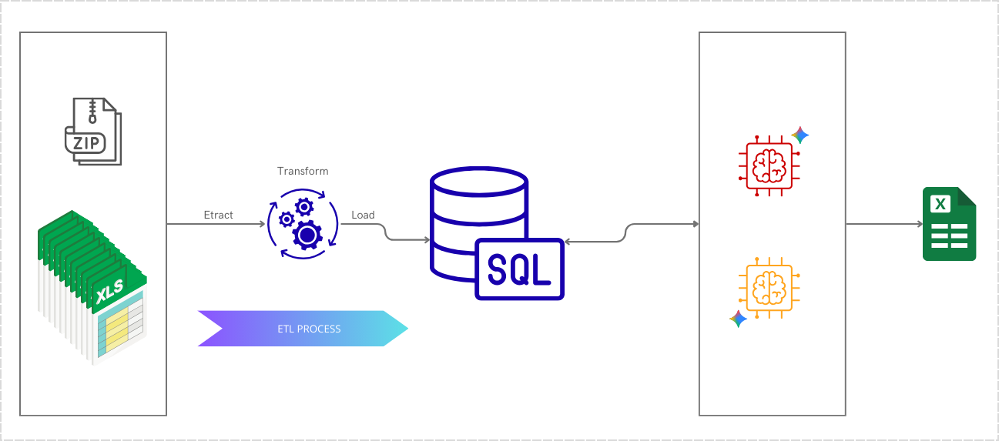
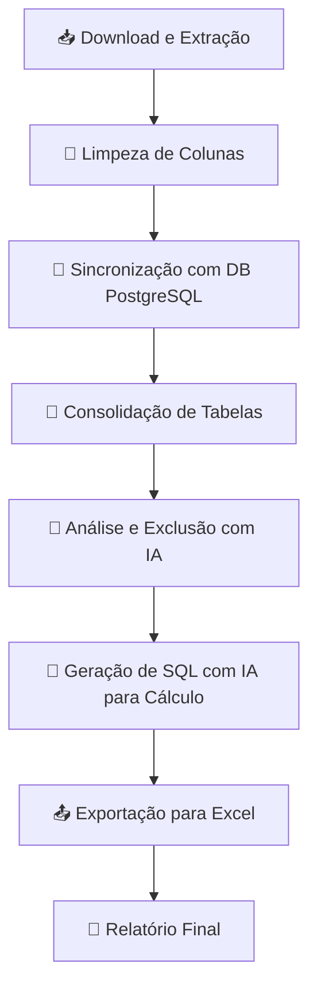

# 🤖 Projeto de Automação de Benefícios de RH com IA


<div align="center">
  
</div>

## 🎯 Visão Geral

Este projeto automatiza o cálculo de benefícios de **Vale-Refeição (VR)** para funcionários, orquestrando um pipeline completo de ponta a ponta. A solução extrai dados de múltiplas planilhas, realiza a limpeza e padronização, sincroniza com um banco de dados **PostgreSQL** e utiliza a **API Gemini do Google** para aplicar regras de negócio complexas, identificando funcionários elegíveis e calculando os valores devidos. Ao final, gera um relatório consolidado em uma planilha Excel formatada.

## ✨ Principais Funcionalidades

* **Extração Automatizada**: Baixa e descompacta arquivos `.zip` de fontes externas.
* **Limpeza e Padronização**: Higieniza nomes de colunas e prepara os dados para processamento.
* **Gerenciamento de Dados Robusto**: Utiliza PostgreSQL para persistência e consulta dos dados.
* **Inteligência Artificial Aplicada**: Emprega a API Gemini para interpretar regras de negócio e gerar consultas SQL dinâmicas.
* **Exportação de Relatórios**: Gera planilhas Excel formatadas e prontas para uso.
* **Design Modular**: Arquitetura baseada em classes com responsabilidades bem definidas.

## 🛠️ Tecnologias Utilizadas

<div align="center">
  
  
  
  
  
</div>

## 🌊 Fluxo de Trabalho

O processo é orquestrado em um pipeline sequencial, garantindo a integridade e o processamento correto dos dados.



1.  **📥 Download e Extração de Dados**: O sistema baixa um arquivo `.zip`, o extrai e padroniza os nomes dos arquivos.
2.  **🧹 Limpeza de Nomes de Colunas**: As colunas de cada planilha são normalizadas para garantir consistência.
3.  **🔄 Sincronização com o Banco de Dados**: Os dados limpos são carregados em tabelas no PostgreSQL.
4.  **🔗 Consolidação de Dados**: Dados de funcionários (ativos, férias, demitidos, etc.) são unificados em uma única tabela.
5.  **🤖 Análise e Exclusão com IA**: O Agente Gemini analisa os dados e identifica funcionários a serem excluídos com base em regras (ex: diretores, estagiários).
6.  **🧠 Geração de SQL com IA**: Um segundo Agente Gemini cria dinamicamente a consulta SQL para calcular o valor do VR dos funcionários elegíveis.
7.  **📤 Exportação de Dados**: Os resultados finais são preenchidos em um template Excel e exportados como um novo relatório.

## 🏗️ Arquitetura e Módulos

O projeto é estruturado em classes modulares, cada uma com uma responsabilidade única no pipeline.

| Classe                 | Descrição                                                                                                  |
| :--------------------- | :--------------------------------------------------------------------------------------------------------- |
| `ZipDownloader`        | Responsável por baixar, extrair e limpar os nomes das planilhas de um arquivo zip.                         |
| `DatabaseConfig`       | Gerencia a configuração da conexão com o banco de dados.                                                   |
| `DBUtils`              | Fornece funções de utilidade para interagir com o banco de dados (verificar, descartar tabelas, etc.).      |
| `ColumnNameCleaner`    | Carrega, limpa e padroniza os nomes das colunas das planilhas.                                             |
| `DataSync`             | Sincroniza os dados das planilhas com o PostgreSQL, criando tabelas e inserindo os dados.                  |
| `DataConsolidator`     | Consolida dados de várias tabelas em uma única tabela (`consolidado`).                                     |
| `DataFrameConsolidado` | Encapsula o acesso ao dataframe da tabela `consolidado`.                                                   |
| `GeminiAgent`          | Cliente para interagir com a API Gemini, com gerenciamento de taxa de chamadas.                            |
| `ExclusionAgent`       | Usa o `GeminiAgent` para analisar e identificar funcionários a serem excluídos com base em regras.         |
| `VrMensalSqlAgent`     | Usa o `GeminiAgent` para gerar a consulta SQL de cálculo dos benefícios.                                   |
| `DataExport`           | Exporta os dados calculados da tabela `vr_mensal` para um arquivo Excel formatado.                         |
| `Infrastructure`       | Orquestra a execução de todo o pipeline de processamento de dados.                                         |

## 🚀 Começando

Siga as instruções abaixo para configurar e executar o projeto em seu ambiente.

### Pré-requisitos

* Python 3.9 ou superior
* Git

### Instalação

1.  **Clone o repositório:**
    ```bash
    git clone [https://github.com/seu-usuario/seu-repositorio.git](https://github.com/seu-usuario/seu-repositorio.git)
    cd seu-repositorio
    ```

2.  **Instale as dependências:**
    ```bash
    pip install pandas psycopg2-binary gdown openpyxl xlrd google-generativeai python-dotenv
    ```

### Configuração

1.  **Variáveis de Ambiente**: Crie um arquivo `.env` na raiz do projeto para armazenar suas credenciais. Nunca exponha essas chaves publicamente.
    ```bash
    # .env
    SUPABASE_HOST="seu_host"
    SUPABASE_NAME="seu_banco"
    SUPABASE_USER="seu_usuario"
    SUPABASE_PASS="sua_senha"
    SUPABASE_PORT="sua_porta"
    GOOGLE_API_KEY="sua_google_api_key"
    ```

2.  **Configuração do Fluxo**: No script principal, ajuste os dicionários de configuração (`infra_config`, `exclusion_config`, etc.) para habilitar ou desabilitar etapas específicas do pipeline.

3.  **Template Excel**: Certifique-se de que o arquivo de modelo (`VR_MENSAL_05.2025.xlsx`) esteja no diretório esperado (`/content/planilhas/`).

### 🏃‍♂️ Como Usar

Com tudo configurado, execute o script principal para iniciar o processo de automação:

```bash
python main.py
```
O script executará todo o fluxo de trabalho. Ao final, o relatório `VR MENSAL 05.2025.xlsx` será gerado no diretório `/content/resultado`.

## 📂 Estrutura do Projeto

```
.
├── assets/
│   └── Arq-Desafio4.png              # Imagem da arquitetura
├── content/
│   ├── planilhas/
│   │   └── VR_MENSAL_05.2025.xlsx  # Template de entrada
│   └── resultado/
│       └── VR MENSAL 05.2025.xlsx  # Relatório final
├── src/
│   ├── modules/
│   │   ├── __init__.py
│   │   ├── downloader.py
│   │   ├── database.py
│   │   ├── cleaner.py
│   │   └── ... (outros módulos)
│   └── main.py                     # Script principal
├── .env                            # Arquivo de credenciais (NÃO versionar)
├── requirements.txt                # Lista de dependências
└── README.md
```

## 🤝 Contribuição

Contribuições são bem-vindas! Se você tiver ideias para melhorias ou encontrar algum problema, sinta-se à vontade para abrir uma *issue* ou enviar um *pull request*.

## 📄 Licença

Este projeto está sob a licença MIT. Veja o arquivo [LICENSE](LICENSE) para mais detalhes.
